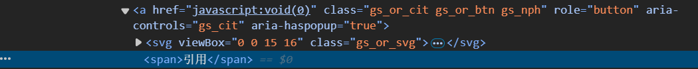

# 工具介绍
根据文章标题列表自动爬取对应的Google Scholar上的bibtex引用信息

使用Selenium，模拟搜索、点击等浏览器操作，点开bibtex链接，爬取内容。

核心函数
```python
def fetch_bibtex(title, browser):
    """根据论文标题从Google Scholar获取BibTeX"""
    gs_url = f"https://scholar.google.com/scholar?hl=en&q={urllib.parse.quote(title)}"
    get(browser, gs_url)
    # 等待页面加载完毕并找到第一个文章的“引用”按钮
    # EC. 方法可选择css样式筛选或者html标签筛选，通过检查前端元素源代码修改
    WebDriverWait(browser, 10).until(EC.presence_of_element_located((By.CSS_SELECTOR, 'a.gs_or_cit.gs_or_btn.gs_nph')))
    citation_button = browser.find_element(By.CSS_SELECTOR, 'a.gs_or_cit.gs_or_btn.gs_nph')
    citation_button.click()
    # 等待弹出窗口出现并找到“BibTeX”链接
    WebDriverWait(browser, 10).until(EC.presence_of_element_located((By.CSS_SELECTOR, "a.gs_citi")))
    bibtex_button = browser.find_element(By.CSS_SELECTOR, 'a[href*="scholar.bib"]')
    bibtex_button.click()
    # 等待BibTeX内容加载
    WebDriverWait(browser, 10).until(EC.presence_of_element_located((By.CSS_SELECTOR, "pre")))
    # 获取BibTeX内容
    # 找到包含BibTeX内容的 <pre> 标签并获取其文本
    bibtex_content = browser.find_element(By.CSS_SELECTOR, "pre").text
    return bibtex_content
```

通过检查网页元素源代码，使用css选择器确定元素。例如想模拟点击“引用”按钮
  

右键点击“引用”，点击“检查”对应到网页元素源代码片段
  

可确定```'a.gs_or_cit.gs_or_btn.gs_nph'```
